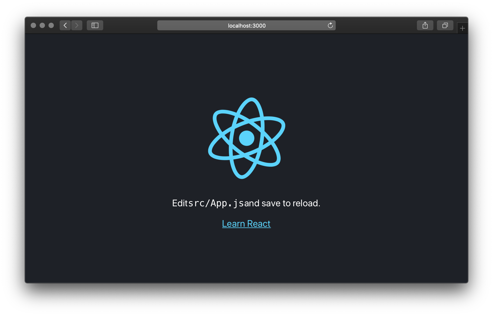
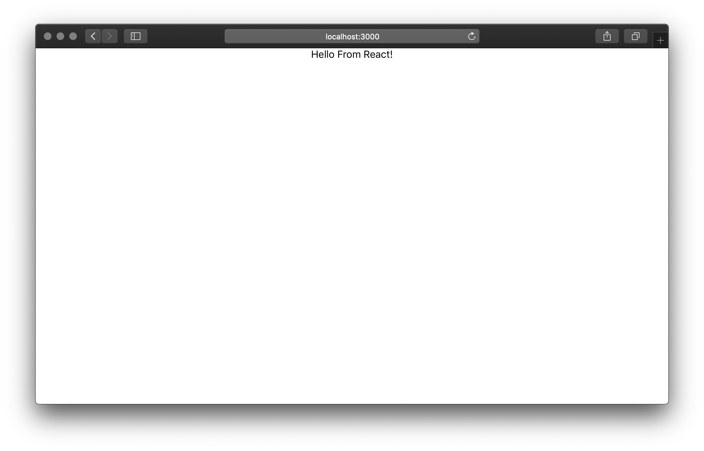

It took some time to understand the patterns in React and why I should use it.
I find it is a great library to develop consistent and maintainable frontends. I mainly code my API in Python and creating complex UI interactions can be tough with html and vanilla js.

I am going to break up the introduction into multiple parts as I always understand things in bite size chunks.

In this post I will show how to use create-react-app utility developed by facebook, which reduces the barrier to entry and the learning curve of webpack configs.

Stephen Grider course on Udemy is a great resource with over 40 hours of content on React. https://www.udemy.com/react-redux/

## What is React?

- React is a JavaScript library - one of the most popular ones, with [over 120,000 stars on GitHub](https://github.com/facebook/react).
- React is an open-source project created by Facebook.
- React can be used to build simple to very complex user interfaces (UI) on the front end.
- React is the **view** layer and you can use it with any API system. I will later show examples with django and asp.net APIs.

One of the most important aspects of React is the fact that you can create **components**, which are like custom, reusable HTML elements, to quickly and efficiently build user interfaces. React also streamlines how data is stored and handled, using **state** and **props**.

## Setup
### 1. Install NodeJS.
React runs on NodeJS, if you do not have it installed, visit https://nodejs.org/en/ and download the LTS version.
To check if NodeJS is now installed on your machine, type the following commands into your command prompt or terminal.

```bash
npm -v
6.4.1
```

```bash
node -v
v10.15.3
```

### 2. Install create-react-app Node Package.

create-react-app node package helps to set up a React project. Install create-react-app node package globally using the following command.

```bash
npm install -g create-react-app
```

### 3. Create the project.

The project can be created using create-react-app. Use the following command to create the project.

```bash
npx create-react-app first-react-app
```

**first-react-app** is the name of the application. The above command creates a folder called first-react-app which is the project folder. In order to test if everything has been set up properly, go into the project folder and start the application using the following command.

```bash
cd first-react-app
npm start
```

Once you run this command, a new window will popup at `localhost:3000` with your new React app.




## Lets code!

Changing the code in `src/App.js` to what is shown below will hot reload the code and the updated page will appear in your browser.

<div class="filename">src/App.js</div>

```jsx
import React, {Component} from 'react';
import './App.css';

class App extends Component {
  render() {
    return (
      <div className="App">
        Hello From React!
      </div>
    );
  }
}

export default App;
```



In the next post I will introduce what we will build to get more use to React. See you soon.